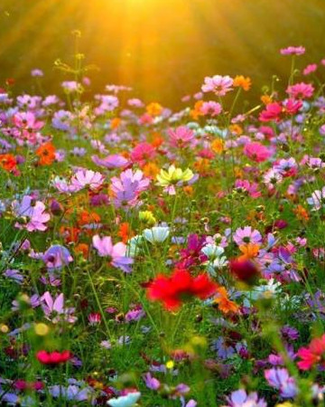

# À la recherche du personnage mystère

Vous avez trouvé une image bien étrange :

Un visage semble se deviner derrière un champ de fleurs... mais quel est ce visage ?

L'image du champ de fleurs ne vous est pas inconnue, d'ailleurs en cherchant bien vous l'avez retrouvée dans vos dossiers :

On dirait que le personnage-mystère a voulu se fondre dans le champ de fleurs...

**XORez-vous découvrir qui est ce personnage-mystère ?**

*aide pour la manipulation d'images et l'extraction de pixels : voir* 
[https://github.com/glassus/snt/blob/master/Theme1_Photographie_numerique/creation_image_python.md](https://github.com/glassus/snt/blob/master/Theme1_Photographie_numerique/creation_image_python.md)