## Architecture d'un réseau

Ce cours a pour but de présenter la constitution classique d'un réseau, et les équipements associés. La partie relative aux protocoles utilisés lors des échanges entre deux machines est détaillée dans le cours [04_Protocoles_de_communication](https://github.com/glassus/nsi/blob/master/Premiere/Theme04_Architecture_materielle/04_Protocoles_de_communication.md).

### 1. Premier réseau local

> [lien](https://www.lernsoftware-filius.de/downloads/Setup/filius_1.9.0_all.deb) de téléchargement de Filius sous Linux

Au sein du logiciel [Filius](https://www.lernsoftware-filius.de/Herunterladen), créons le réseau local ci-dessous :

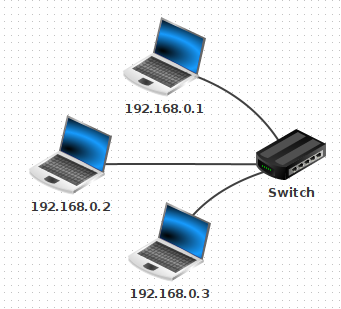

Testons le ```ping``` de la machine ```192.168.0.1```  vers la machine ```192.168.0.3```.

<details><summary> Résultat </summary>
<p>

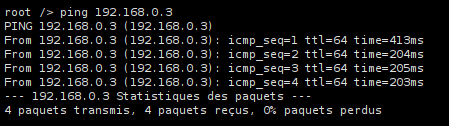
</p>
</details>

<br>


#### 1.1. La carte réseau et son adresse MAC
Chaque ordinateur sur le réseau dispose d'une adresse MAC, qui une valeur **unique** attribuée à sa carte réseau (Ethernet, Wifi, 4G, 5G, ...) lors de sa fabrication en usine.

Cette adresse est codée sur 48 bits, présentés sous la forme de 6 octets en hexadécimal. Exemple : ```fc:aa:14:75:45:a5```

Les trois premiers octets correspondent au code du fabricant.
Un site comme https://www.macvendorlookup.com/ vous permet de retrouver le fabricant d'une adresse MAC quelconque.

#### 1.2. Switch, hub, quelle différence ?

- Au sein d'un **hub Ethernet** (de moins en moins vendus), il n'y a **aucune analyse** des données qui transitent : il s'agit simplement d'un dédoublement des fils de cuivre (tout comme une multiprise électrique). L'intégralité des messages est donc envoyée à l'intégralité des ordinateurs du réseau, même s'ils ne sont pas concernés.

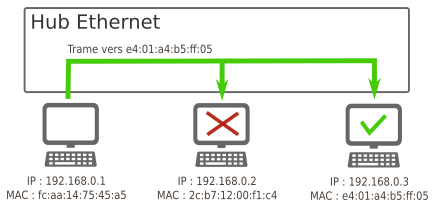

- Au sein d'un **switch Ethernet** , une analyse est effectuée sur la trame qui est à distribuer (voir [ici](https://github.com/glassus/nsi/blob/master/Premiere/Theme04_Architecture_materielle/04_Protocoles_de_communication.md)). Lors d'un branchement d'un nouvel ordinateur sur le switch, celui-ci récupère son adresse MAC, ce qui lui permet de **trier** les messages et de ne les distribuer qu'au bon destinataire.

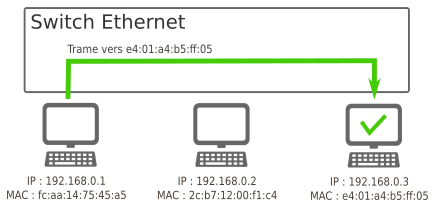

### 2. Un deuxième sous-réseau

Rajoutons un deuxième sous-réseau de la manière suivante (penser à bien renommer les switchs).

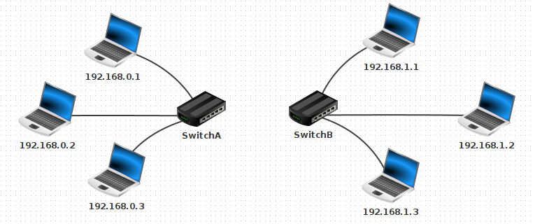

**Comment relier ces deux sous-réseaux ?**

Une réponse pas si bête : avec un cable entre les deux switchs !

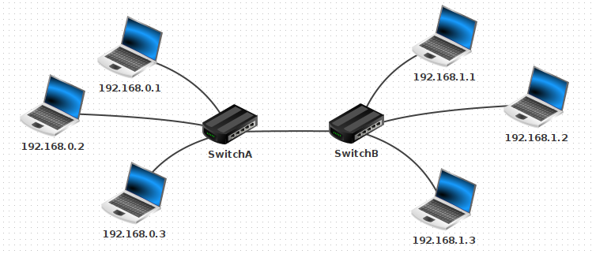

1. Testons cette hypothèse en essayant de pinger la machine ```192.168.1.2``` depuis la machine ```192.168.0.1```. 
<details><summary> Résultat </summary>
<p>

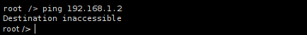

Cela ne marche pas. Les paquets sont perdus.
</p>
</details>

<br>

2. Temporairement, renommons la machine ```192.168.1.2``` en ```192.168.0.33```. Testons à nouveau le ping depuis la machine ```192.168.0.1```.

<details><summary> Résultat </summary>
<p>

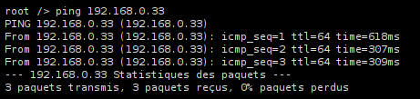

Cela marche. Les paquets sont bien acheminés.
</p>
</details>

<br>


**Intuition** : la notion de sous-réseau n'est pas *topologique* («il suffit de relier les ordinateurs entre eux») mais obéit à des règles numériques.

#### 2.1. Notion de masque de sous-réseau

Dans Filius, lors de l'attribution de l'adresse IP à une machine, une ligne nous permet de spécifier le **masque de sous-réseau** (appelé simplement « Masque » dans Filius). C'est ce masque qui va permettre de déterminer si une machine appartient à un sous-réseau ou non, en fonction de son adresse IP.

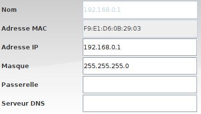

##### 2.1.1 Explication basique
- Si le masque est ```255.255.255.0```, toutes les machines partageant les mêmes **trois** premiers nombres de leur adresse IP appartiendront au même sous-réseau. Comme ceci est le réglage par défaut de Filius, cela explique pourquoi  ```192.168.0.33``` et ```192.168.0.1``` sont sur le même sous-réseau, et pourquoi  ```192.168.1.2``` et ```192.168.0.1``` ne sont pas sur le même sous-réseau.

Dans cette configuration, 256 machines peuvent donc appartenir au même sous-réseau (ce n'est pas tout à fait le cas car des adresses finissant par 0 ou par 255 sont réservées).

- Si le masque est ```255.255.0.0```, toutes les machines partageant les mêmes **deux** premiers nombres de leur adresse IP appartiendront au même sous-réseau.  
Dans cette configuration, 65536 machines peuvent être dans le même sous-réseau. (car 256^2=65536)


**Exercice**
- Renommons ```192.168.0.33``` en ```192.168.1.2``` et modifions son masque en ```255.255.0.0```.
- Modifions aussi le masque de ```192.168.0.1``` en ```255.255.0.0```.
- Testons le ping de ```192.168.0.1``` vers ```192.168.1.2```.

<details><summary> Résultat </summary>
<p>

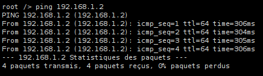

Cela marche. Les deux machines appartiennent maintenant au même sous-réseau.
</p>
</details>

<br>

##### 2.1.2 Explication avancée

Lorsqu'une machine A veut envoyer un message à une machine B, elle doit déterminer si cette machine :
- appartient au même sous-réseau : auquel cas le message est envoyé directement via un ou plusieurs switchs.
- n'appartient pas au même sous-réseau : auquel cas le message doit d'abord transiter par un routeur (voir 3.)

Quelle opération permet de distinguer cette appartenance à un même sous-réseau ?

Appelons ```IP_A``` et ```IP_B``` les adresses IP respectives des machines A et B.  
Appelons ```M``` le masque de sous-réseau.  
Nommons ```&``` l'opérateur de conjonction entre nombres binaires (voir [ici](https://github.com/glassus/nsi/blob/master/Premiere/Theme03_Representation_des_donnees/05_Operateurs_booleens.ipynb)): 

**Propriété :** A et B appartiennent au même sous-réseau ⇔ ```IP_A & M = IP_B & M```

Exemple : considérons trois machines A, B, C d'IP respectives ```192.168.129.10```, ```192.168.135.200``` et ```192.168.145.1```, configurées avec un masque de sous-réseau égal à ```255.255.248.0```.  

|        | machine A      | machine B       | machine C     |
|--------|----------------|-----------------|---------------|
| IP     | 192.168.129.10 | 192.168.135.200 | 192.168.145.1 |
| M      | 255.255.248.0  |  255.255.248.0  | 255.255.248.0 |
| IP & M | 192.168.128.0  |  192.168.128.0  | 192.168.144.0 |

rappel des règles de calcul :
- pour tout octet ```x```, ```x & 255 = x```  et ```x & 0 = 0```.
- ```129 & 248``` s'écrit en binaire ```10000001 & 11111000``` qui vaut ```10000000```, soit ```128``` en décimal.

Conclusion : les machines A et B sont sous le même sous-réseau, mais pas la machine C.

##### 2.1.3 Cohérence entre les deux explications
Lorsqu'un masque de sous-réseau est égal à ```255.255.255.0```, l'opération de conjonction ```&``` avec chaque IP ne laissera intacts que les 3 premiers octets, le dernier sera égal à 0. Donc si deux adresses s'écrivent ```A.B.C.X``` et   ```A.B.C.Y```, elles appartiendront forcément au même sous-réseau (typiquement, c'est le cas de ```192.168.0.33``` et ```192.168.0.1```).

#### 2.2 Écriture des masques de sous-réseau : notation CIDR

D'après ce qui précède, 2 informations sont nécessaires pour déterminer le sous-réseau auquel appartient une machine : son IP et le masque de sous-réseau. 
Une convention de notation permet d'écrire simplement ces deux renseignements : la notation CIDR.

**Exemple** : Une machine d'IP ```192.168.0.33``` avec un masque de sous-réseau ```255.255.255.0``` sera désignée par ```192.168.0.33 / 24``` en notation CIDR.

Le suffixe ```/ 24``` signifie que le masque de sous-réseau commence par  24 bits consécutifs de valeur 1 : le reste des bits (donc 8 bits) est à mis à 0.  
Autrement dit, ce masque vaut ```11111111.11111111.11111111.00000000``` , soit ```255.255.255.0```.  
De la même manière, le suffixe ```/ 16``` donnera un masque de ```11111111.11111111.00000000.00000000``` , soit ```255.255.0.0```.  
Ou encore, un suffixe ```/ 21``` donnera un masque de ```11111111.11111111.11111000.00000000``` , soit ```255.255.248.0```. 


### 3. Un vrai réseau contenant deux sous-réseaux distincts : la nécessité d'un routeur

Notre solution initiale (relier les deux switchs par un cable pour unifier les deux sous-réseaux) n'est pas viable à l'échelle d'un réseau planétaire.

Pour que les machines de deux réseaux différents puissent être connectées, on va utiliser un dispositif équipé de **deux cartes réseaux**, situé à cheval entre les deux sous-réseaux. Ce équipement de réseau est appelé **routeur** ou **passerelle**.

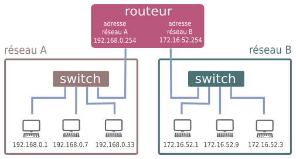

#### 3.1 Principe de fonctionnement
Imaginons que la machine ```192.168.0.1 / 24``` veuille communiquer avec la machine  ```172.16.52.3 / 24```.  
L'observation du masque de sous-réseau de la machine ```192.168.0.1 / 24``` nous apprend qu'elle ne peut communiquer qu'avec les adresses de la forme ```192.168.0.X / 24```, où ```X``` est un nombre entre 0 et 255. 

Les 3 étapes du **routage** :
- Lorsque qu'une machine A veut envoyer un message à une machine B, elle va tout d'abord vérifier si cette machine appartient à son réseau local. si c'est le cas, le message est envoyé par l'intermédiaire du switch qui relie les deux machines.
- Si la machine B n'est pas trouvée sur le réseau local de la machine A, le message va être acheminé vers le routeur, par l'intermédiaire de son adresse de passerelle (qui est bien une adresse appartenant au sous-réseau de A).
- De là, le routeur va regarder si la machine B appartient au deuxième sous-réseau auquel il est connecté. Si c'est le cas, le message est distribué, sinon, le routeur va donner le message à un autre routeur auquel il est connecté et va le charger de distribuer ce message : c'est le procédé (complexe) de [routage](https://openclassrooms.com/fr/courses/857447-apprenez-le-fonctionnement-des-reseaux-tcp-ip/854659-le-routage), qui sera vu en classe de Terminale.

Dans notre exemple, l'adresse ```172.16.52.3``` n'est pas dans le sous-réseau de ```192.168.0.1```. Le message va donc transiter par le routeur.  
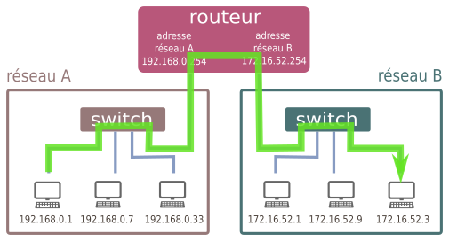 

#### 3.2 Illustration avec Filius

- Rajoutons un routeur entre le SwitchA et le SwitchB.
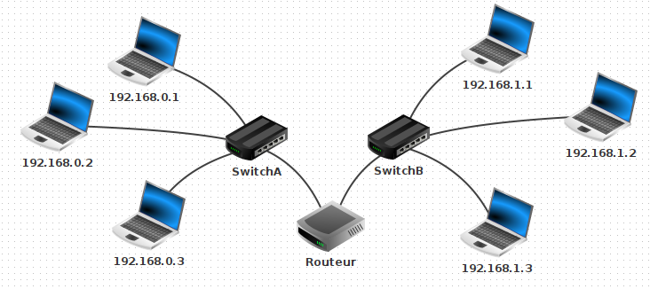

- Configuration du routeur :
     L'interface reliée au Switch A doit avoir une adresse du sous-réseau A. On donne souvent une adresse finissant par ```254```, qui est en quelque sorte la dernière adresse du réseau (en effet l'adresse en ```255``` est appelée adresse de **broadcast**, utilisée pour pinger en une seule fois l'intégralité d'un sous-réseau).  
     On donne donc l'adresse ```192.168.0.254``` pour l'interface reliée au Switch A, et ```192.168.1.254``` pour l'interface reliée au Switch B.  
     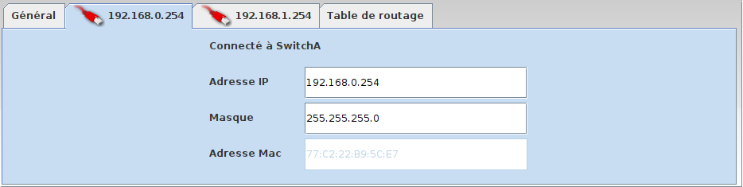  
     Dans l'onglet général, sélectionner « Routage automatique ».  
     Ainsi configuré notre routeur peut jouer le rôle de **passerelle** entre les deux sous-réseaux.
<br>

- Test du ping entre ```192.168.0.1``` et ```192.168.1.2``` : 
<details><summary> Résultat </summary>
<p>


Cela ne marche pas. Les paquets sont perdus.
</p>
</details>

<br>

Pourquoi cet échec ? Parce que nous devons dire à chaque machine qu'une passerelle est maintenant disponible pour pouvoir sortir de son propre sous-réseau. Il faut donc aller sur la machine ```192.168.0.1``` et lui donner l'adresse de sa passerelle, qui est ```192.168.0.254```.

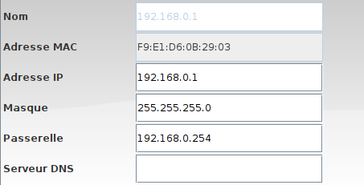

Attention, il faut faire de même pour ```192.168.1.2``` (avec la bonne passerelle...)  
Testons à nouveau le ping... Cette fois cela marche.

Plus intéressant : effectuons un ```traceroute``` entre  ```192.168.0.1``` et ```192.168.1.2```.

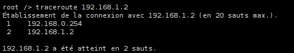

On y aperçoit que la machine ```192.168.1.2``` est atteignable en deux sauts depuis ```192.168.0.1```, en passant par la passerelle ```192.168.0.254```


**Cas d'un réseau domestique**  

Chez vous, la box de votre opérateur joue simultanément le rôle de switch et de routeur :
- switch car elle répartit la connexion entre les différents dispositifs (ordinateurs branchés en ethernet, smartphone en wifi, tv connectée...)
- routeur car elle fait le lien entre ce sous-réseau domestique (les appareils de votre maison) et le réseau internet.

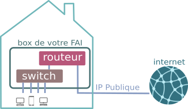 

L'image ci-dessous présente le résultat de la commande ```ipconfig``` sous Windows. On y retrouve l'adresse IP locale ```192.168.9.103```, le masque de sous-réseau ```255.255.255.0``` et l'adresse de la passerelle ```192.168.9.1```.  
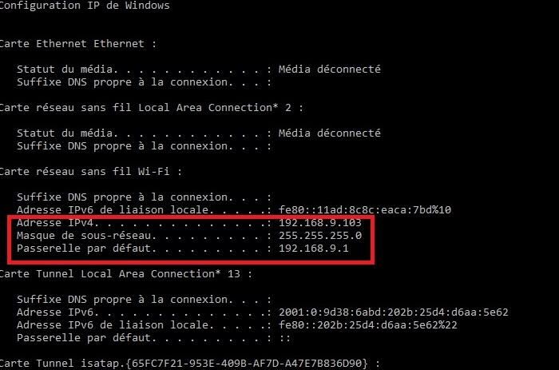

#### 3.3 Annexe : rajout d'un serveur DNS

##### 3.3.1 Rajout d'un serveur web
- Connectons un ordinateur au SwitchB, sur l'adresse ```192.168.1.30``` et installons dessus un Serveur web et démarrons-le. 
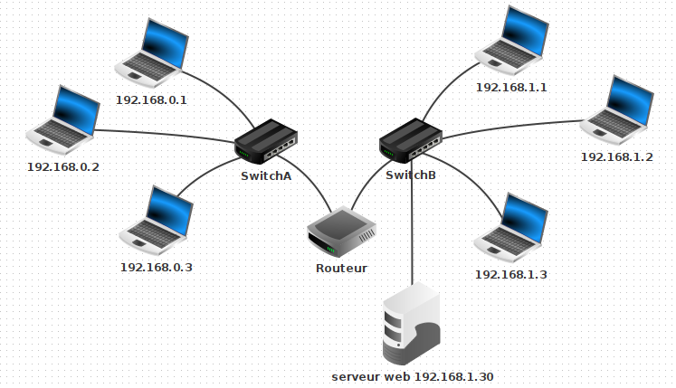 

- Sur la machine ```192.168.0.1```, rajoutons un Navigateur Web. En tapant dans la barre d'adresse l'adresse IP du Serveur web, la page d'accueil de Filius s'affiche.  
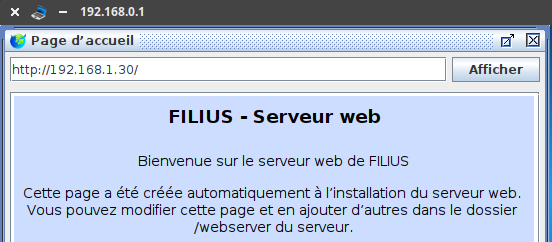

Lors d'une utilisation classique d'un navigateur web, c'est une url mémorisable qui s'affiche, et non une adresse IP : on retient en effet plus facilement https://www.google.com/ que http://216.58.213.131, qui renvoient pourtant à la même adresse. 
La machine qui assure ce rôle d'annuaire entre les serveurs web et leur adresse IP s'appelle un **serveur DNS**. Pour pouvoir indexer la totalité des sites internet, son rôle est structuré de manière hiérarchique. Vous trouverez des détails ici : https://openclassrooms.com/fr/courses/857447-apprenez-le-fonctionnement-des-reseaux-tcp-ip/857163-le-service-dns

##### 3.3.1 Rajout d'un serveur DNS
- Rajoutons un serveur DNS minimal, qui n'aura dans son annuaire d'un seul site. Il faut pour cela raccorder une nouvelle machine (mais une machine déjà sur le réseau aurait très bien pu jouer ce rôle), et installer dessus un serveur DNS.  
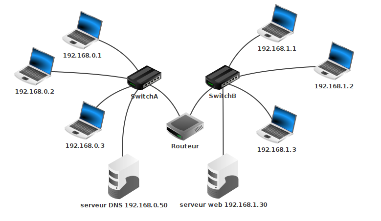 
- Sur ce serveur DNS, associons l'adresse ```http://www.vivelansi.fr```  à l'adresse IP ```192.168.1.30```.  
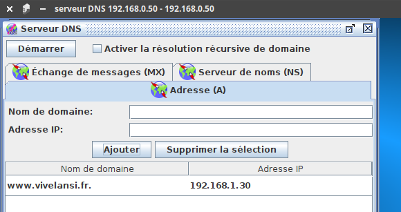 

- De retour sur notre machine ```192.168.0.1```, spécifions maintenant l'adresse du serveur DNS :  
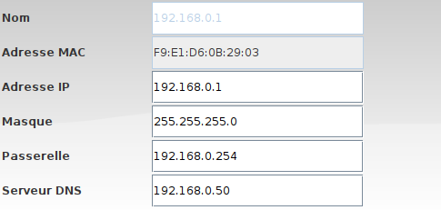

- Depuis le navigateur web de la machine ```192.168.0.1```, le site ```http://www.vivelansi.fr``` est maintenant accessible.  
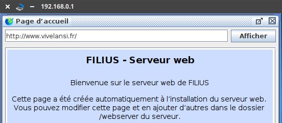 


<br>

---
**Bibliographie**
- Numérique et Sciences Informatiques, 1re, T. BALABONSKI, S. CONCHON, J.-C. FILLIATRE, K. NGUYEN, éditions ELLIPSES.
- Cours d'OpenClassrooms : 
    - https://openclassrooms.com/fr/courses/857447-apprenez-le-fonctionnement-des-reseaux-tcp-ip/854659-le-routage
    - https://openclassrooms.com/fr/courses/1561696-les-reseaux-de-zero/3607286-ladressage-cidr


---


G.Lassus, Lycée François Mauriac --  Bordeaux  
