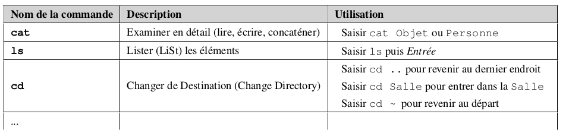
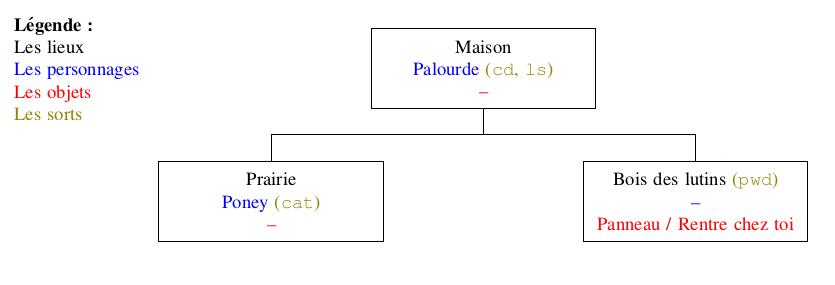

# Découverte des commandes UNIX

à partir du jeu Terminus

 

Rendez-vous à l'adresse [http://luffah.xyz/bidules/Terminus/](http://luffah.xyz/bidules/Terminus/)

Laissez-vous guider par le jeu, mais attention !
- vous devez noter sur un papier chaque nouvelle commande que vous apprenez. Vous pouvez par exemple construire un tableau de ce type :

 

- je vous conseille très fortement d'écrire un plan du jeu **au fur et à mesure** que vous avancez dans votre quête. Par exemple :

 

## Correction
Voici [un corrigé](data/Terminus-corrige.pdf) établi par Charles Poulmaire, de l'académie de Versailles.
