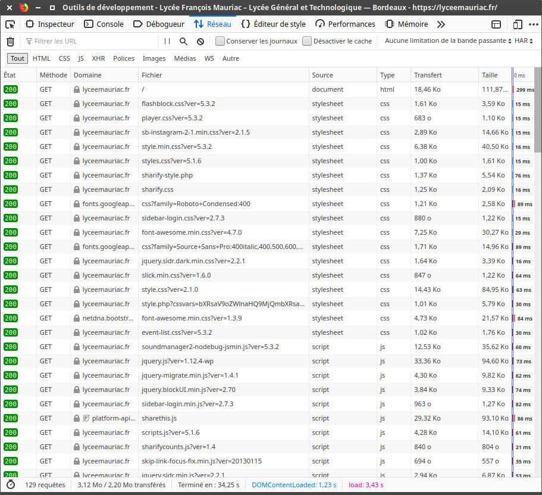

# Protocole HTTP : étude du chargement d'une page web


## Le protocole HTTP : des requêtes et des réponses
 HTTP (HyperText Transfer Protocol) est le protocole qui régit la communication entre : 
 - le client (la machine de l'utilisateur qui souhaite obtenir une page web). On dit que le client effectue une **requête**.
 - le serveur (la machine sur laquelle sont stockés les fichiers nécessaires à l'affichage de cette page web). Le serveur va renvoyer une **réponse**.
 
<center>

</center>

### Déroulé d'une requête
Prenons pour exemple la requête d'un navigateur vers la page ```html://glassus1.free.fr/interesting.html``` 

- le navigateur analyse l'url : la demande concerne la page ```interesting.html```, stockée sur le serveur ```glassus1.free.fr```.  
- une demande est préalablement effectuée auprès pour obtenir l'adresse IP du serveur ```glassus1.free.fr``` (qui est en fait un sous-domaine du serveur des pages personnelles de l'opérateur Free). Ici, l'adresse IP sera ```212.27.63.111``` (on la retrouvera dans la capture de la fenêtre d'Outils de devéloppement).
- la requête est effectuée sur le port 80 de l'adresse ```212.27.63.111```.
- la réponse est envoyée au navigateur, qui en extrait la charge utile et procède à l'affichage de la page.


### Analyse à l'aide d'un navigateur

Observons à partir de l'Inspecteur d'élément d'un navigateur (ici Firefox) les informations qui transitent lors de la requête et de la réponse.


- Point **1** : La requête de type GET vers l'url ```http://glassus1.free.fr/interesting.html``` a généré un code de réponse **200 OK**, ce qui signifie que la requête a été traitée et que la réponse contenant la page a été envoyée.  
Vous pouvez trouver à l'adresse https://developer.mozilla.org/fr/docs/Web/HTTP/Status la totalité des codes de réponse possibles. 
Citons par exemple : 
    - **304 Not Modified** : la page n'a pas eu besoin d'être renvoyée, elle indique au navigateur d'aller la rechercher dans son cache. On peut obtenir ce code de réponse en actualisant la page actuelle ```http://glassus1.free.fr/interesting.fr``` (qui est une page ultra-basique, et n'évolue pas). Pour ré-obtenir un code 200, il faut faire un hard-refresh en appuyant sur Maj pendant l'actualisation.
    - **403 Forbidden** : le client n'a pas le droit d'accès à la page.
    - **404 Not Found** : la page demandée est introuvable
    - **500 Internal Server Error** : le serveur a rencontré une erreur qu'il ne sait pas traiter.

<br>

- Point **2** : en observant la taille totale des données transférées (388 octets), on peut comprendre que la réponse faite par le serveur est constituée :
    - d'un **En-tête** (264 octets) qui contient :
    ```
    HTTP/1.1 200 OK
    Date: Wed, 22 Apr 2020 08:02:01 GMT
    Server: Apache/ProXad [Jan 23 2019 19:58:42]
    Last-Modified: Sun, 12 Apr 2020 16:39:55 GMT
    ETag: "15d7c75-7c-5e93445b"
    Connection: close
    Accept-Ranges: bytes
    Content-Length: 124
    Content-Type: text/html
    ``` 
    - du corps de la **Réponse** (dont on sait d'après l'en-tête qu'il pèse 124 octets). Ce corps de la réponse est la charge utile de la réponse. Elle contient ici le code html de la page :
    ```
    <!DOCTYPE html>
    <html>
    <head>
    <title>Waouh</title>
    </head>
    <body>
    Ceci est vraiment une jolie page web.
    </body>
    </html>
    ```

**Remarque :** on peut observer que le navigateur a aussi effectué (de sa propre initiative) une requête vers un fichier ```favicon.ico``` qui est l'icone de la page web dans les onglets du navigateur ou la barre de favoris. Ce fichier était bien présent sur le serveur (ce n'est pas toujours le cas), il a donc été envoyé dans la réponse du serveur. 

De manière générale, une requête vers un site web moins élémentaire va occasionner une multitude de réponses.

Par exemple, l'appel au site ```www.lyceemauriac.fr``` génère 129 requêtes/réponses différentes, composées de fichiers html, css, js, de fichiers de fontes woff2, d'images jpg, png...


