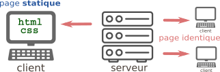
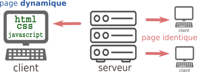

# Pages web et interactions

### 1. Le cas le plus simple : la même page pour tout le monde



#### 1.1 HTML pur

Lorsque le client demande au serveur le contenu d'une page web, celui-ci lui renvoie, dans le cas le plus simple, une simple page html.  
HTML est un langage dit « à balises ».  Ce n'est pas à proprement parler un langage de programmation, mais plutôt un langage de description de contenu.

**Exemple de page web minimale**

```html
<!DOCTYPE html>
<html lang='fr'>
    <head>
        <metacharset="utf-8">
        <title>Un titre très original</title>
    </head>

    <body>
        <p>Ceci est le texte introductif de ma page.</p>
        <p>
           <h1>  Ceci est un titre de niveau 1 </h1>
           Mais sans rien d'intéressant.
           <h2>  Ceci est un titre de niveau 2 </h2>
              <ul>
                  <li> le début d'une liste indentée </li>
                  <li> la suite ... </li>
              </ul>  
        Pour apprendre le fonctionnement des balises, voir <a href="https://developer.mozilla.org/fr/docs/Apprendre/HTML/Introduction_%C3%A0_HTML/Getting_started"> ici</a> par exemple !
        </p>
    </body>
</html>

```

##### Exercice 1


#### 1.2 HTML + CSS


### 2. Quand le client peut agir sur sa page : exemple avec Javascript



### 3. Quand la page est fabriquée à la demande pour le client : exemple avec PHP


