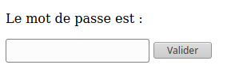
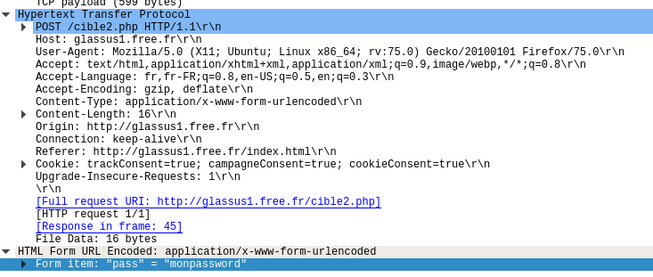

# Formulaires

## 1. Comment envoyer des paramètres à un serveur ?

### 1.1. La méthode GET

Considérons le formulaire suivant, inclus dans une page html ouverte dans le navigateur du client :

```html 
Le mot de passe est :
<form action="cible2.php" method="get">
<p>
    <input type="password" name="pass" /> 
    <input type="submit" value="Valider" />
</p>
</form>
```

**Aperçu :**




**Explications :**
- le fichier ```cible2.php``` est le fichier sur le serveur qui recevra les paramètres contenus dans le formulaire.
- le paramètre sera nommé ```pass``` et sera de type ```password```, ce qui signifie qu'on n'affichera pas les caractères tapés par l'utilisateur.
On aurait pu aussi avoir un type :
    - ```text``` : le texte s'affiche en clair (pour les login par ex) 
    - ```radio``` : pour une sélection (d'un seul élément)
    - ```checkbox``` : pour une sélection (éventuellement multiple)
- un bouton comportant le label «Valider» déclenchera l'envoi (grâce au type particulier ```submit``` des paramètres (ici un seul, la variable ```pass```) au serveur.

#### Test :
1. Rendez-vous sur la page http://glassus1.free.fr/ex_get.html et testez un mot de passe.
2. Observez attentivement l'url de la page sur laquelle vous êtes arrivés. Que remarquez-vous ?


#### La méthode GET et la confidentialité :
Les paramètres passés au serveur par la méthode GET sont transmis **dans l'url de la requête**. Ils sont donc lisibles **en clair** par n'importe qui.


Évidemment, c'est une méthode catastrophique pour la transmission des mots de passe. Par contre, c'est une méthode efficace pour accéder directement à une page particulière : ainsi l'url https://www.google.fr/search?q=bordeaux nous amènera directement au résultat de la recherche Google sur le mot-clé «bordeaux».


### 1.2. La méthode POST

Dans notre code de formulaire du 1.1, modifions l'attribut ```method```, auparavant égal à ```"get"```. Passons-le égal à ```"post"```  :

```html 
Le mot de passe est :
<form action="cible2.php" method="post">
<p>
    <input type="password" name="pass" /> 
    <input type="submit" value="Valider" />
</p>
</form>
```

#### Test :
1. Rendez-vous sur la page http://glassus1.free.fr/ex_post.html et testez un mot de passe.
2. Observez attentivement l'url de la page sur laquelle vous êtes arrivés. Que remarquez-vous ?

#### La méthode POST et la confidentialité :
Les paramètres passés au serveur par la méthode POST **ne sont pas visibles** dans l'url de la requête. Ils sont contenus dans le corps de la requête, mais non affichés sur le navigateur.


Donc, la transmission du mot de passe est bien sécurisée par la méthode POST ? 

Pas du tout ! Si le protocole de transmission est du ```http```  et non pas du ```https```, n'importe qui interceptant le trafic peut lire le contenu de la requête et y trouver le mot de passe en clair.

**Exemple avec [Wireshark](https://www.wireshark.org/)** :



Le contenu de la variable ```"pass"``` est donc visible dans le contenu de la requête. 

Le passage en ```https``` chiffre le contenu de la requête et empêche donc la simple lecture du mot de passe.