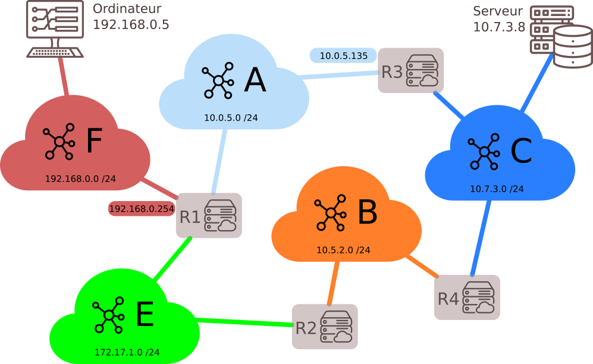

# Protocoles de routage


## 0. Résumé des épisodes précédents

- [cours](https://github.com/glassus/nsi/blob/master/Premiere/Theme04_Architecture_materielle/03_Architecture_reseau.md) de 1ère sur l'architecture d'un réseau
- [cours](https://github.com/glassus/nsi/blob/master/Premiere/Theme04_Architecture_materielle/04_Protocoles_de_communication.md) de 1ère sur les différents protocoles de communication dans un réseau.

**Notions essentielles :**
Lorsqu'une machine A, d'adresse IP_A veut discuter avec une machine B, d'adresse IP_B:
- La machine A calcule (grâce au masque de sous-réseau) si B est dans le même sous-réseau qu'elle, ou pas.
- Si oui, elle peut donc connaître l'adresse MAC de la carte réseau de la machine B (soit elle la possède déjà dans sa table ARP, soit elle la demande en envoyant un message de broadcast à tout le sous-réseau : «qui possède cette adresse IP_B ?»).
Elle envoie donc dans le sous-réseau une trame ayant pour entête l'adresse MAC de B : le switch lit cette trame, sait sur quel port est branché la machine B et lui envoie spécifiquement donc le message.
- Si B n'est pas dans le même sous-réseau que A, A mettra en entête de sa trame l'adresse MAC de la carte réseau du routeur, qui joue le rôle de passerelle. Le routeur va ouvrir la trame et va observer l'IP_B, à qui il doit remettre ce message. C'est maintenant que vont intervenir les protocoles de routage :
    - est-ce que B est dans le même sous-réseau que le routeur ?
    - est-ce que B est dans un autre sous-réseau connu du routeur ?
    - est-ce que B est totalement inconnu du routeur ?


Ces questions trouveront des réponses grâce à **table de routage** du routeur.

## 1. Tables de routage




Les tables de routage sont des informations stockées dans le routeur permettant d'aiguiller intelligemment les données qui lui sont transmises.

Dans le réseau ci-dessus, si l'ordinateur d'adresse ```192.168.0.5``` veut interroger le serveur ```10.7.3.8``` :
- l'adresse ```10.7.3.8``` n'étant pas dans le sous-réseau F (d'adresse ```192.168.0.0 / 24```), la requête est confiée au routeur via son adresse passerelle dans le réseau F (ici ```192.168.0.254```).
- le routeur observe si l'IP recherchée appartient à un autre des sous-réseaux auquel il est connecté. Ici, l'IP recherchée ```10.7.3.8``` n'appartient ni au sous-réseau A ou E. 
- le routeur va donc regarder dans sa table de routage l'adresse passerelle d'un autre routeur vers qui elle doit rediriger les données. Si le sous-réseau C fait partie de sa table de routage, le routeur R1 saura alors que le meilleur chemin est (par exemple) de confier les données au routeur R3.
- si le sous-réseau C ne fait pas partie de la table de routage, le routeur R1 va alors le rediriger vers une route «par défaut» (que l'on peut assimiler au panneau «toutes directions» sur les panneaux de signalisation).

Par exemple, la table de routage du routeur R1 pourrait être :

| Destination | Passerelle |
|-|-|
| 192.168.0.0 /24 | 192.168.0.254 |
| 172.17.1.0 /24 | 172.17.1.254 |
| 10.0.5.0 /24 | 10.0.5.152 |
| 10.5.2.0 /24 | 172.17.1.254 |
| 10.7.3.0 /24 | 10.0.5.135 |


#### Comment sont construites les tables de routage ?
- Soit à la main par l'administrateur réseau, quand le réseau est petit : on parle alors de table **statique**.
- Soit de manière **dynamique** : les réseaux s'envoient eux-mêmes des informations permettant de mettre à jour leurs tables de routages respectives. Des algorithmes de détermination de meilleur chemin sont alors utilisés : nous allons en découvrir deux, le protocole RIP et le protocole OSPF.